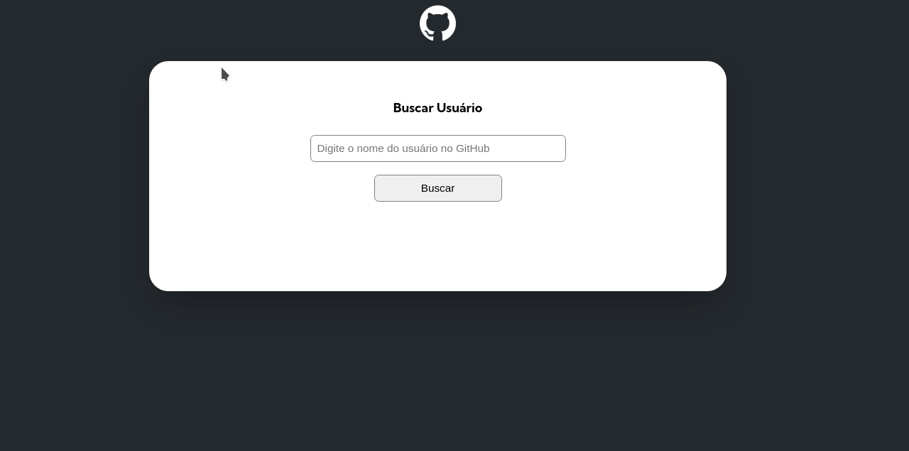

# 🪓🪵 projeto-inicial-fetch-github-api 🪵🪓
Projeto inacabado⛑️ . 
Aqui virá a quest do JavaScript Featch api 

Confira as funcionalidades já presentes: 

- Busca por usuários
- Validação de busca por click e por teclado
- busca por reposirórios
- Impedimento de busca com valor vazio
- Mensagem informando quando não possui titulo e bio
- Informar quando não existe o usurário.
